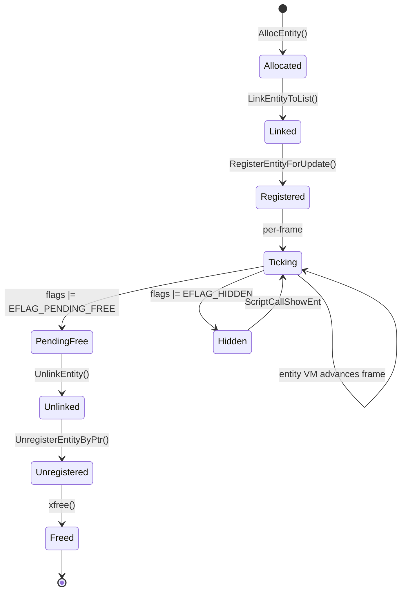
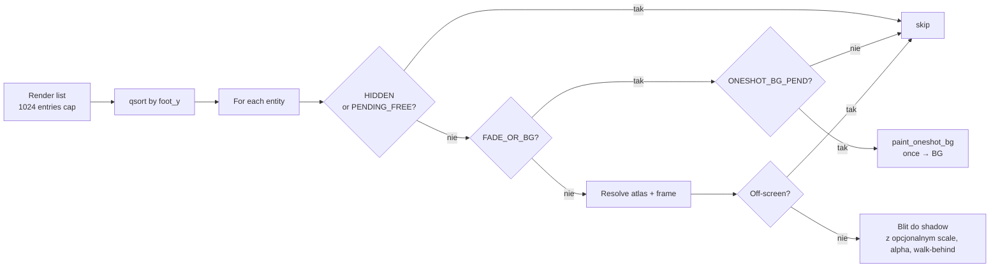
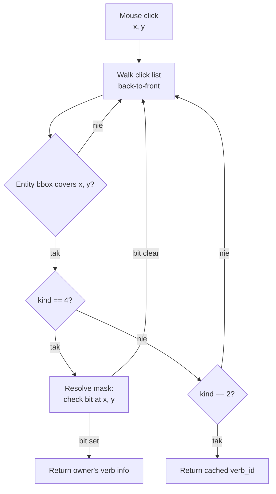

# Entity system

Każdy obiekt w scenie Wackich — Ebek, Fjej, kioskarz, ptak na latarni,
strzała kursora, baner reklamowy — to **Entity**. Single, opaque
struct z którego pól prawie wszystko reszta engine'u czyta przez
bezpośredni `EOFF(e, OFFSET, type)`.

## Layout

`Entity` to po prostu blok pamięci ~256 bajtów. Pola są dostępne przez
**byte-offsety**, nie nazwy struktur — żeby zachować dokładnie to co
oryginał ma w swoich `.data` tablicach. Pełna lista offsetów:
`include/entity_offsets.h`.

Najważniejsze pola:

| Offset | Pole | Co trzyma |
|---:|---|---|
| `+0x00` | `width`, `height` | (port-only) tylko dla kind=1 speech balloons |
| `+0x08` | `flags` (u16) | Bit 0 visible, 0x40 FADE_OR_BG, 0x20 ONESHOT_BG_PEND, 0x100 ALPHA, 0x800 HIDDEN, 0x2000 PENDING_FREE |
| `+0x0A` | `drawn_x` | Pozycja gdzie ostatnio narysowany (set przez VM lub render path) |
| `+0x0C` | `drawn_y` | j.w. |
| `+0x0E` | verb_table (slot) | Pointer (przez ent_ptr_intern) do tabeli verbów dla kind=1 |
| `+0x12` | cached verb_id | Single verb dla kind=2 entities |
| `+0x22` | `anchor_x` | Logiczna pozycja entity — co script chce żeby było |
| `+0x24` | `anchor_y` | j.w. |
| `+0x26` | `foot_y` | Y-coord stopy actor'a, key do Z-sort |
| `+0x28` | `atlas_slot` | Pointer (przez ent_ptr_intern) na AnimAsset |
| `+0x2C` | `bytecode_slot` | Pointer (interned) na bytecode per-entity VM |
| `+0x2E` | `pc` | Program counter w u16-stride |
| `+0x30` | `frame_idx` | Bieżąca klatka animacji |
| `+0x3A` | `state_flags` | bit 0 FRAME_READY, bit 1 WALKER_FRESH, bit 2 ANIM_ACTIVE |
| `+0x3C` | `delay` | Per-entity VM tick counter |
| `+0x3E` | `delay_reset` | Reset value cyklicznego delay |
| `+0x42`-`+0x4A` | walker state | Fixed-point pos (X.16, Y.16), targets |
| `+0x4C`/`+0x50` | walker remaining | dx/dy left, walker stops gdy oba zerują |
| `+0x58` | `scale_pct` | Perspective scaling (0 = no scale, 100 = original) |

`include/entity_offsets.h` definiuje `EOFF(e, off, type)` makro do
typesafe-ish access oraz `ENT_OFF_*` symbole dla każdego znanego offsetu.

## Kategorie (`kind`)

Każde entity ma `kind` (port-internal, w trailing zone struct'a po
`+0xE0`). Cztery wartości używane przez shipped script'y:

| `kind` | Cel | Przykłady | Render? | Click? |
|---:|---|---|:---:|:---:|
| 1 | Asset z verb table — drawn-by-owner | Actor sprites, animowane prop'y | tak | nie* |
| 2 | Clickable sprite | Hotspot na scenie, picked-up itemy | tak | tak |
| 3 | Walk-behind mask / animated prop | Krzaki, kioski (zasłaniają actora) | mask blit | nie |
| 4 | Click payload | (mask, verb) tuples — invisible | nie | tak |

\* kind=1 nie są same clickable ale ich `owner` (zwykle kind=4 click
payload) może być. `FindEntityByVerbId(verb)` walks click list, dla
kind=4 entries zwraca jego `owner` z `+0x0a` slot.

## Update table

Oddzielnie od list renderera/clicków, engine trzyma **update table**
indeksowaną przez `(kind, id)` — `RegisterEntityForUpdate(e, k, id)`.
Skrypty wołają to przez ScriptCallowy gdy chcą rezerwować logical
id dla entity. Lookup `FindUpdateRegistration(kind, id)` to LIFO,
więc późniejsze rejestracje "shadow'ują" wcześniejsze pod tym
samym (k, id).

LIFO matters dla scripts z patternem:
```scr
load asset A as id=N
load asset B as id=N  # shadow A
destroy id=N           # drops B (LIFO top)
                       # A is still registered, scripts find it again
```

## Lifecycle



Komnata enter:
1. `EntityListClearAll` — wyrzuca poprzednie kind=1/3/4 entities
   (actor'y zachowywane przez special-case w `is_protected_actor_entry`)
2. `RunScriptInterpreter(enter_script)` — script spawnuje propy + scenery
3. Per-spawn: `AllocEntity` → set fields → `LinkEntityToList` →
   ewentualnie `RegisterEntityForUpdate`

Komnata exit (lub `destroy id=N`):
1. `ScriptCallDestroyEnt(id, also_unreg_asset)`
2. For each kind in DESTROY_KIND_FIRST..LAST:
   - Find entity matching (k, id)
   - **`StopAllSfxForAsset(atlas->name)`** — żeby pętle SFX nie żyły dalej
   - `UnregisterEntityByPtr` → `UnlinkEntity` → `xfree`

## Render list

Z-sorted blit, raz na klatkę gry, na shadow buffer (8-bpp paletted):



Sortowanie po `foot_y` (`+0x26`) — niższe Y idą pierwsze (rysowane
najpierw, są **z tyłu**). Wyższe Y są bliżej kamery → na wierzchu.

## One-shot BG paint

Entity z `EFLAG_FADE_OR_BG | EFLAG_ONESHOT_BG_PEND` (flags bits 0x40 + 0x20)
maluje swoją klatkę **raz na BG**, potem ma czyszczony bit ONESHOT_BG_PEND.
Use case: animowane elementy tła które zmieniają klatkę co kilkadziesiąt
ticków (np. słup elektryczny, dziewczynka w piaskownicy). Każda zmiana
klatki ustawia PEND ponownie przez per-entity VM, render path wywołuje
`paint_oneshot_bg`, BG się aktualizuje, PEND clears.

Historyczny gotcha: oryginalny port wywoływał `FlushFrameToPrimary()`
**w środku** loop'a renderera w `paint_oneshot_bg`. To prezentowało
half-rendered frame'a (bez actorów, bo oni są sortowani PO BG-paint
entities). Aktorzy migali. Naprawione w `2469a66` przez usunięcie
inner flush'a — outer flush w `paint_frame` końcuje wszystko atomowo.

## Click hit-test



Walk-behind mask entities (kind=3) **nie są click targets** — same
zasłaniają actora gdy przechodzi za nimi. Faktyczny click payload
to kind=4 entities z `mask_data` reference'm na ten sam mask asset.

## Walker — fixed-point line stepping

Walker state w polach `+0x42`-`+0x4A`:
- `walker_x_fp` (int32) — fixed-point X position (16.16)
- `walker_y_fp` (int32) — fixed-point Y
- `walker_x_hi` (int16, aliased on `walker_x_fp + 2`) — integer part
- `walker_y_hi` (int16, aliased) — integer part
- `walker_target_x`, `walker_target_y` (int16)
- `walker_dx_rem`, `walker_dy_rem` (int32) — fixed-point step left

Każdy `WALK_TO_X/XY` opcode dodaje `dx_rem` do `walker_x_fp`,
sprawdza czy `walker_x_hi == target_x` → wyzerowuje `dx_rem`.
Walking kończy się gdy oba remainings są 0.

Aliasing-safe: kompilator może spróbować zreordować
`walker_x_fp += inc` z następującym `walker_x_hi == target_x`
read'em. Bez `-fno-strict-aliasing` walker przeszacowuje target
o 1px per tick i nigdy nie zatrzymuje (T-bug naprawiony w
`actor/vm.c` z explicit local-variable copy każdej iteracji).
Makefile cementuje to dodatkowo flagą.

## Per-click waypoint Dijkstra

`BindActorWalker(actor_idx, click_x, click_y)` to entry point dla
ruchu pinged przez click:

1. **Phase 1**: jeśli klik na non-walkable, backstep do najbliższego
   walkable pixela
2. **Phase 2**: spróbuj prostej linii do target'u
3. **Phase 3**: jeśli linia przerwana → Dijkstra na waypoint graph
   (`ActorWaypoints` per actor) — najkrótsza ścieżka przez bandy
   perspektywy → bind walker do pierwszego hop'a, reszta queue'd

`PerActorWaypointAdvanceTick` woływany co klatkę — gdy walker drains,
advance do kolejnego waypoint'a; ostatni leg → `BindActorWalker`
do oryginalnego clicku.

## Referencje w kodzie

- **Allocator + lists**: `src/actor/alloc.c`, `src/actor/list.c`
- **Update table**: `src/actor/registration.c`
- **Slot interning**: `src/actor/intern.c` (`ent_ptr_intern`, `ent_ptr_resolve`)
- **Per-entity VM**: `src/actor/vm.c` ([per-entity-vm.md](per-entity-vm.md))
- **Walker + Dijkstra**: `src/actor/walker.c`
- **Renderer**: `src/actor/render.c`
- **Offsets**: `include/entity_offsets.h`
- **Tests**:
  - `tests/test_entity_layout.c` — compile-time invariants
  - `tests/test_ent_ptr_intern.c` — interning
  - `tests/test_update_registration.c` — LIFO + EXCEPT semantics
  - `tests/test_click_hit_test.c`, `test_click_queue.c`
  - `tests/test_per_entity_vm*.c` — VM
  - `tests/test_walker.c` — fixed-point math
